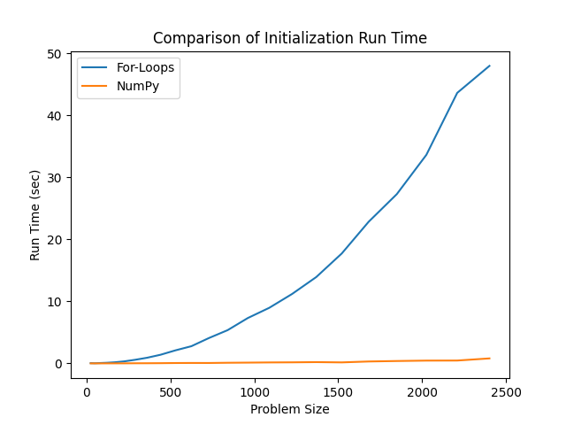

# Important Note

This repository is a fork of [D-Wave's original ev-charger-placement](https://github.com/dwave-examples/ev-charger-placement). The contributors to this fork do not claim ownership or authorship of the original codebase. All credit for the original work belongs to D-Wave Systems and its respective contributors.

This fork introduces improvements in computational efficiency, a refined problem formulation, and an updated implementation that uses the QDeepHybridSolver API from the [qdeepsdk](https://pypi.org/project/qdeepsdk/1.0.1/) package.

# Placement of Charging Stations

Determining optimal locations to build new electric vehicle charging stations is a complex optimization problem. Many factors should be taken into consideration, such as existing charger locations, points of interest (POIs), and the number of new stations to build. In this example, we formulate the problem as a binary optimization (QUBO) task and solve it using a hybrid quantum-classical solver.

The problem is encoded via a QUBO matrix that incorporates four key objectives:

- **Minimize distance to POIs:** New charging stations should be close to points of interest for user convenience.
- **Maximize distance to existing charging stations:** New stations should not overlap with or be too near current chargers.
- **Maximize distance between new charging stations:** Spreading out new chargers maximizes overall regional coverage.
- **Enforce exactly two new charging stations:** The model includes a hard constraint to select exactly the specified number of new charging stations.

In this fork, we build the QUBO matrix manually—either using explicit loops (in `demo.py`) or vectorized NumPy operations (in `demo_numpy.py`)—and then solve the problem using QDeepHybridSolver.

## Usage

To run the loop-based demo:

```sh
python demo.py
```

Or to run the NumPy vectorized version:

```sh
python demo_numpy.py
```

Both scripts generate a grid-based city scenario. For example, by default the code creates a 15x15 grid with 3 randomly placed POIs and 4 existing charging stations. The QUBO formulation then selects locations for 2 new charging stations. After the solver runs, a visualization is saved as `map.png` (showing POIs, existing stations in red, and new stations in blue) and the results are printed to the command line.

### Customizing the Scenario

You can adjust various parameters via command-line options:

- `-x`: Grid width (default: 15)
- `-y`: Grid height (default: 15)
- `-p`: Number of POIs (default: 3)
- `-c`: Number of existing charging stations (default: 4)
- `-n`: Number of new charging stations to place (default: 2)
- `-s`: Random seed for reproducibility

For example:

```sh
python demo.py -x 10 -y 10 -c 2
```

This builds a random scenario on a 10x10 grid with 3 POIs, 2 existing chargers, and 2 new locations to be identified.

## Problem Formulation

The core of this project is the formulation of the charging station placement as a QUBO problem. Each potential new charging station location is represented by a binary variable. Four independent constraints are used to shape the optimization:

### Minimize Distance to POIs

For each candidate location, we calculate the average Euclidean squared distance to all POIs. A positive bias proportional to this average (weighted by a tunable parameter `gamma1`) is added to the QUBO matrix to encourage selections near POIs.

### Maximize Distance to Existing Charging Stations

Similarly, for each candidate we compute the average distance to existing charging stations. A negative bias (scaled by `gamma2`) is applied so that locations farther from current stations are preferred.

### Maximize Distance Between New Charging Stations

For every pair of candidate locations, the pairwise distance is computed, and a negative quadratic bias (weighted by `gamma3`) is applied. This encourages the new charging stations to be spread out over the grid.

### Build Exactly Two New Charging Stations

In our QUBO formulation, we enforce that exactly `num_new_cs` (e.g., two) new charging stations are selected by modifying the QUBO matrix. Instead of using a built-in function like `dimod.generators.combinations`, we add penalty terms directly:  
- A linear bias of `gamma4 * (1 - 2*num_new_cs)` is added to each candidate (diagonal elements).  
- A quadratic bias of `2 * gamma4` is added to every off-diagonal pair.  

Together, these terms penalize any configuration where the total number of active (i.e. 1-valued) binary variables deviates from `num_new_cs`. The tunable parameter `gamma4` controls the strength of this constraint within the overall optimization problem.

## Faster QUBO Construction

Two versions of the code are provided:  
- **demo.py:** Builds the QUBO using explicit Python loops.  
- **demo_numpy.py:** Constructs the same QUBO using vectorized NumPy operations for improved efficiency.  

As problem instances become larger, the NumPy-based approach can significantly reduce initialization time.



## Solver Integration

The QUBO is solved using the [QDeepHybridSolver](https://pypi.org/project/qdeepsdk/1.0.1/) from the qdeepsdk package. In our code, after constructing the QUBO matrix, we initialize the solver, set the authentication token, optionally adjust parameters like `m_budget` and `num_reads`, and call its `solve` method. The result (which includes the binary configuration, energy, and runtime) is then mapped back to the candidate nodes to identify which new locations have been selected.

## References

[1] Pagany, Raphaela, Anna Marquardt, and Roland Zink. "Electric Charging Demand Location Model—A User-and Destination-Based Locating Approach for Electric Vehicle Charging Stations." *Sustainability* 11.8 (2019): 2301. [https://doi.org/10.3390/su11082301](https://doi.org/10.3390/su11082301)
